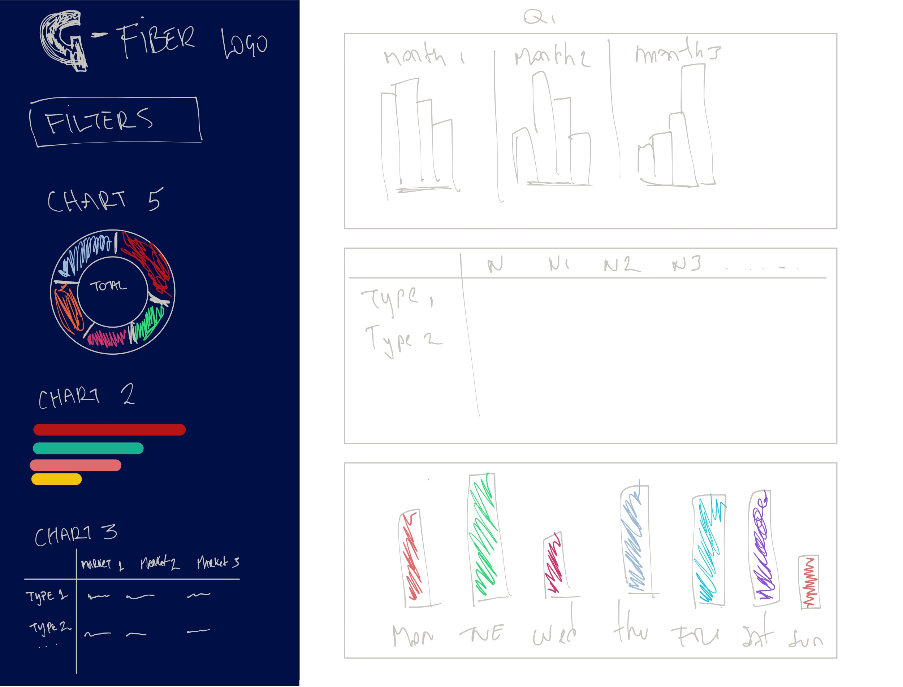
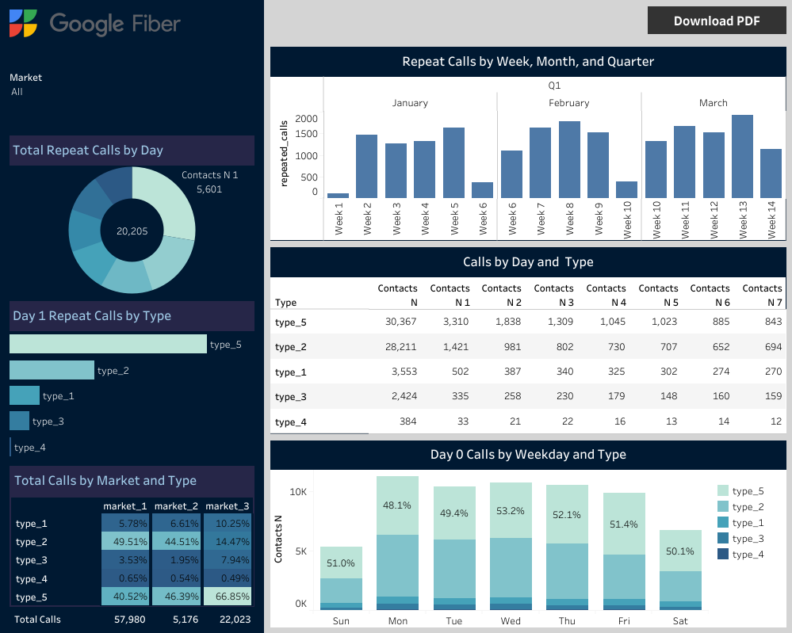
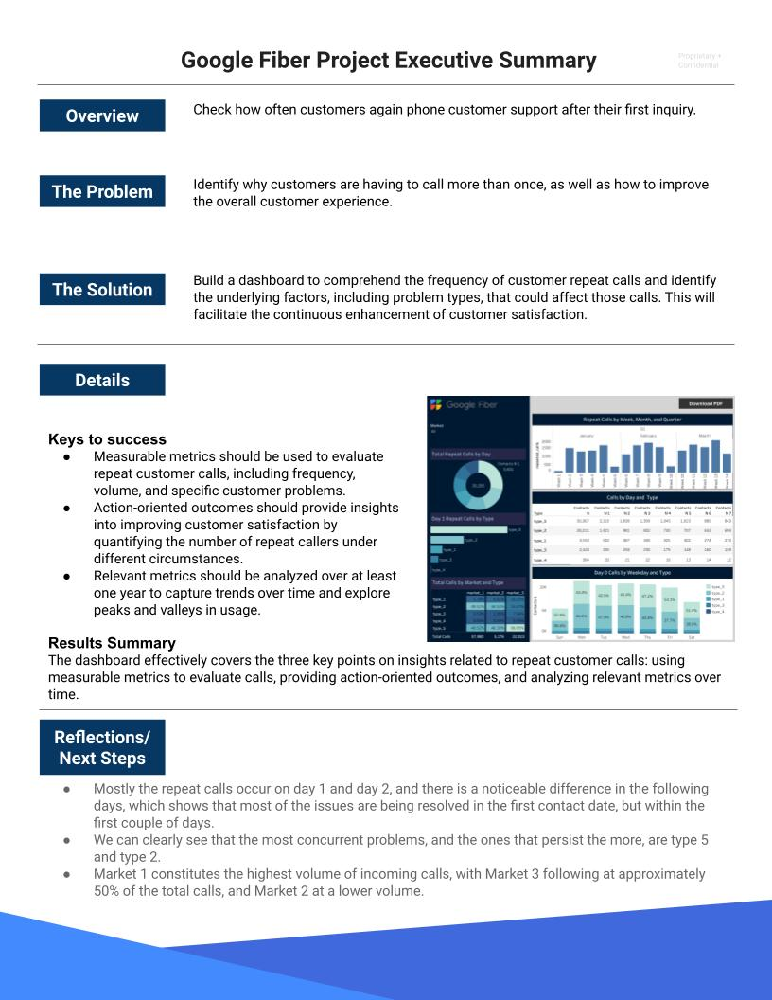

# Google-Fiber-BI (WIP)

<br>

[](https://github.com/SCantergiani/Google-Fiber-BI#google-fiber-bi)

<br>

The Google Fiber case study  is a capstone project for Google Business Intelligence Professional Course that will go through each step of the BI Process. Google Fiber, provides people and businesses with fiber optic internet. The Fiber customer service uses business intelligence to monitor and improve customer satisfaction, and team has asked to design a dashboard using fictional data for this purpose.

### Table of Contents

1. [Project Planning](https://github.com/SCantergiani/Google-Fiber-BI/blob/main/G-Fiber-Case-Study.md#project-planning)
2. [Data Preparation (ETL)](https://github.com/SCantergiani/Google-Data-Analytics-Certificate/blob/main/SQL%20&%20Power%20BI%20Version/SQL%20&%20Power%20BI%20Version.md#prepare)
3. [Deshboard Design](https://github.com/SCantergiani/Google-Data-Analytics-Certificate/blob/main/SQL%20&%20Power%20BI%20Version/SQL%20&%20Power%20BI%20Version.md#process)

### Tools Used

* SQL - BigQuery for data preparation and processing.
* Tableau - for further analysis and data visualizations.
* Github- for store codes and changelogs into notebooks.

### Resources

* Details of the case study can be found [here](https://github.com/SCantergiani/Google-Fiber-BI/blob/main/Docs/GOOGLE%20FIBER%20CASE%20STUDY.pdf).
* The datasets used can be download [here](https://github.com/SCantergiani/Google-Fiber-BI/tree/main/Files).
* Link to the dashboard hosted in Tableau Public can be found [here](https://public.tableau.com/views/GoogleFiber/Dashboard?:language=en-US&:display_count=n&:origin=viz_share_link).

### Deliverables

*	A chart or table measuring repeat calls by their first contact date.
*	A chart or table exploring repeat calls by market and problem type.
*	Charts showcasing repeat calls by week, month, and quarter.


## Project Planning

Using the case study information to to complete the Stakeholder [Requirements Document], [Project Requirements Document], and [Planning Document]. Some of the key points of each are:

### Stakeholder Requirements Document

**Primary requirements:**

* A chart or table measuring repeat calls by their first contact date.
* A chart or table exploring repeat calls by market and problem type.
* Provide insights into the types of customer issues that seem to generate more repeat 
calls.
* Explore repeat caller trends in the three different market cities.
* Design charts so that stakeholders can view trends by week, month, quarter, and year.

### Project Requirements Document

**Assumptions:** The case study fictional data has been already anonymized using **market_1, 
market_2, and market_3** to indicate three different city service areas the data represents. Also 
lists five problem types:

* Type_1 is account management.
* Type_2 is technician troubleshooting.
* Type_3 is scheduling.
* Type_4 is construction.
* Type_5 is internet and wifi.

Additionally, the dataset records repeat calls over seven-day periods. The initial contact date is 
listed as contacts_n. The other call columns are then contacts_n_number of days since first call. 
For example, contacts_n_6 indicates six days since first contact.

### Planning Document

Mockup:
[](https://github.com/SCantergiani/Google-Fiber-BI#google-fiber-bi)

## Data Preparation (ETL)

Step 1: Loading the CSV files into GCP

[](https://github.com/SCantergiani/Google-Fiber-BI#google-fiber-bi)

Step 2:  Querying the data

Because the tables are already cleaned and the columns match, we can use a UNION ALL statement. The UNION ALL statement is applied here instead of a JOIN statement because the tables already have matching columns, making them easy to merge completely. 


```sql
SELECT
  *
FROM
  `markets.market1`
UNION ALL
SELECT
  *
FROM
  `markets.market2`
UNION ALL
SELECT
  *
FROM
  `markets.market3`
```
Other method to combine specific rows in case we didn't need all of them, could of been this code:

```sql
SELECT
  date_created,
  contacts_n,
  contacts_n_1,
  contacts_n_2,
  contacts_n_3,
  contacts_n_4,
  contacts_n_5,
  contacts_n_6,
  contacts_n_7,
  new_type,
  new_market
FROM `your project.fiber.market_1`
UNION ALL
SELECT
  date_created,
  contacts_n,
  contacts_n_1,
  contacts_n_2,
  contacts_n_3,
  contacts_n_4,
  contacts_n_5,
  contacts_n_6,
  contacts_n_7,
  new_type,
  new_market
FROM `your project.fiber.market_2`
UNION ALL
SELECT
  date_created,
  contacts_n,
  contacts_n_1,
  contacts_n_2,
  contacts_n_3,
  contacts_n_4,
  contacts_n_5,
  contacts_n_6,
  contacts_n_7,
  new_type,
  new_market
FROM `your project.market_3`
```
*Total rows: 1350

The output is a merged dataset, that can be seen [here](https://github.com/SCantergiani/Google-Fiber-BI/blob/main/Files/Consolidated_Markets.csv).

Step 3: 

After the query has finished running, we will be able to download the consolidated data as CSV files by using the Save Results dropdown and selecting the appropriate file type.

[](https://github.com/SCantergiani/Google-Fiber-BI#google-fiber-bi)

Now we can upload it to Tableau, and start working into the Dashboard.

## Dashboard Design

Step 1: Load the data into Tableu.

Step 2: Create a [low-fidelity mockup](https://github.com/SCantergiani/Google-Fiber-BI/blob/main/README.md#planning-document).

Step 3: Creating the charts.

Paying close attention to the project goals outlined in your project planning documents. This will ensure that your charts answer stakeholder questions.

Step 4: Organize the Dashboard.

The live dashboard can be seen [here](https://public.tableau.com/views/GoogleFiber/Dashboard?:language=en-US&publish=yes&:display_count=n&:origin=viz_share_link)

[](https://github.com/SCantergiani/Google-Fiber-BI#google-fiber-bi)

Step 5: Make a excecutive summary


