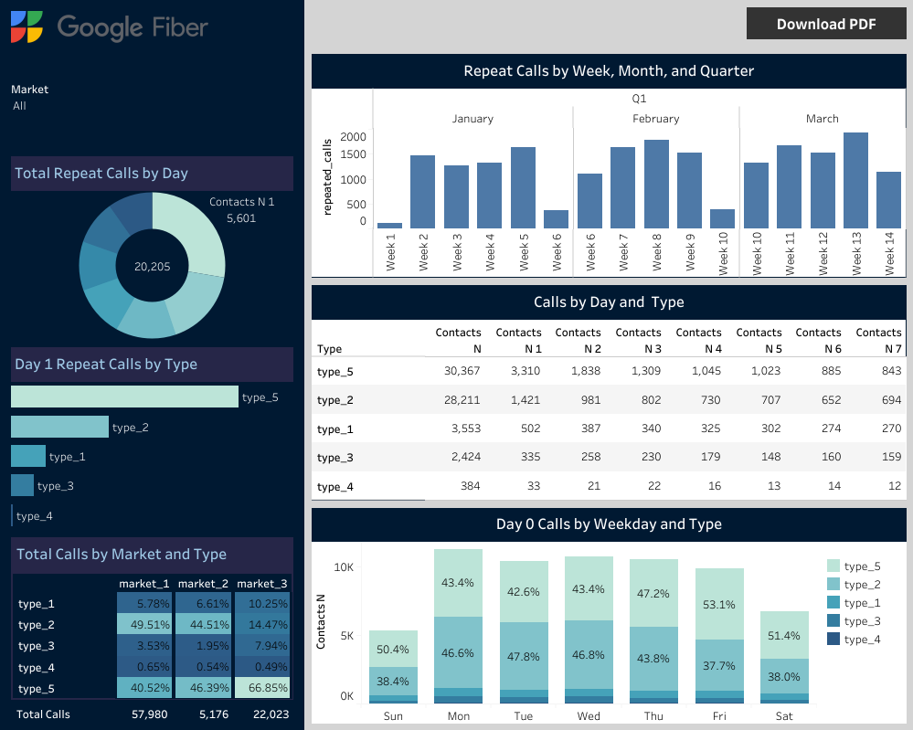

# Google-Fiber-BI

The Google Fiber case study  is a capstone project for Google Business Intelligence Professional Course that will go through each step of the BI Process. Google Fiber, provides people and businesses with fiber optic internet. The Fiber customer service uses business intelligence to monitor and improve customer satisfaction, and team has asked to design a dashboard using fictional data for this purpose.

### Table of Contents

1. [Project Planning](https://github.com/SCantergiani/Google-Data-Analytics-Certificate/blob/main/SQL%20&%20Power%20BI%20Version/SQL%20&%20Power%20BI%20Version.md#ask)
2. [Data Preparation](https://github.com/SCantergiani/Google-Data-Analytics-Certificate/blob/main/SQL%20&%20Power%20BI%20Version/SQL%20&%20Power%20BI%20Version.md#prepare)
3. [Deshboard Design](https://github.com/SCantergiani/Google-Data-Analytics-Certificate/blob/main/SQL%20&%20Power%20BI%20Version/SQL%20&%20Power%20BI%20Version.md#process)

### Tools Used

* SQL - BigQuery for data preparation and processing.
* Tableau - for further analysis and data visualizations.
* Github- for store codes and changelogs into notebooks.

### Resources

* Details of the case study can be found [here](https://github.com/SCantergiani/Google-Fiber-BI/blob/main/Docs/GOOGLE%20FIBER%20CASE%20STUDY.pdf).
* The datasets used can be download [here](https://github.com/SCantergiani/Google-Fiber-BI/tree/main/Files).
* Link to the Dashboard hosted in Tableau Public can be found [here](https://public.tableau.com/views/GoogleFiber/Dashboard?:language=en-US&:display_count=n&:origin=viz_share_link).

### Deliverables

*	A chart or table measuring repeat calls by their first contact date.
*	A chart or table exploring repeat calls by market and problem type.
*	Charts showcasing repeat calls by week, month, and quarter.


## Project Planning

Using the case study information to to complete the Stakeholder Requirements Document, Project Requirements Document, and Planning Document.

### Stakeholder Requirements Document

### Project Requirements Document

### Planning Document


## Data Preparation

Loading the CSV files into GCP

Merging tables

```sql
SELECT
  *
FROM
  `markets.market1`
UNION ALL
SELECT
  *
FROM
  `markets.market2`
UNION ALL
SELECT
  *
FROM
  `markets.market3`
```

Total rows: 1350

Download the new consolidated CSV and upload to Tableau.

## Dashboard Design

1) Load the relevant data into Tableau
2) Make problem type chart and change name to reflect the problems (Count distinct contacts N)

[](https://github.com/SCantergiani/Google-Fiber-BI#google-fiber-bi)
